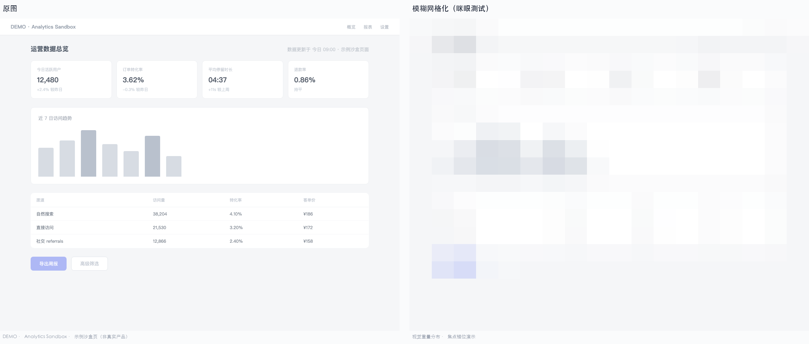

# CI Gate · 对比度与 CSS Token 卫生自动化门禁
# CI Gate for Contrast & CSS Token Hygiene

   

**English** — A CI gate for WCAG contrast and CSS token hygiene. Fails the build on contrast regressions and design-token drift. Pure Python standard library, zero third-party dependencies.

Catches the failures that code review misses and that reach production: **a colour pair that dropped below AA, a token that silently changed, a hardcoded hex that bypassed the system**.

> 🔎 **想要的不止对比度？** 商业版 **UI 设计评估 Pro** —— 一次调用交付八维量化评分 + S/A/B/C/D 定级 + P0–P2 分级修复建议。**按次计费、无需订阅**：
> `skillhub install ui-design-eval-pro --namespace user_65c8c185`
>
> *Need more than contrast? The commercial **UI Design Evaluation Pro** returns 8-dimension scores, an S/A/B/C/D grade, and P0–P2 fixes in one call — **pay-per-call, no subscription**: `skillhub install ui-design-eval-pro --namespace user_65c8c185`*

**Install / 安装**

```bash
# 作为 Agent Skill 安装 / Install as an Agent Skill
npx skills add johnsmithCA-sta/wcag-contrast-ci
# or / 或
skillhub install wcag-contrast-ci --namespace user_65c8c185
# or / 或
git clone https://github.com/johnsmithCA-sta/wcag-contrast-ci.git
```

> 技能包本体位于 [`skills/wcag-contrast-ci/`](./skills/wcag-contrast-ci/)（`SKILL.md` + `scripts/`），供依赖 GitHub 抓取的 Agent Skill 索引站收录。其中的脚本与仓库根目录的 CI 脚本是两份实体副本，改动请同步两边 / *The skill package lives in `skills/wcag-contrast-ci/` for Agent Skill indexers that crawl GitHub. Scripts there are a physical copy of the repo-root CI scripts — keep both in sync.*

---

> **零第三方依赖（仅 Python 标准库）· 可独立分发作 CI 门禁 · 五分钟接入 GitHub Actions**
> **Zero third-party dependencies (Python standard library only) · Ship as a standalone CI gate · Five-minute integration with GitHub Actions**

---

## 它能做什么 / What it does

**两个独立的 Python 标准库脚本**，直接 `cp` 到 CI 流水线即可跑：

**Two independent Python-standard-library scripts. Copy them straight into your CI pipeline.**

### `contrast_checker.py` — 对比度门禁 / Contrast Gate

批量校验前景 / 背景色对的 WCAG 2.x 对比度，支持 normal / large / ui 三种达标线，默认 AA 级。失守即退出码 1，CI 步骤失败。色值可省略 `#`（`ffffff` 与 `#ffffff` 等效）；若有色值无法解析，结论会被显式标注为**无效**并以退出码 2 结束——不会伪装成「全部达标」放行。

Batch-validates WCAG 2.x contrast ratios for foreground/background color pairs. Supports `normal` / `large` / `ui` thresholds (WCAG AA defaults). Exit code 1 on failure — CI step fails. The leading `#` is optional; if any color fails to parse the verdict is marked invalid and the tool exits with code 2 instead of reporting a pass.

```bash
cat > color-pairs.txt <<'EOF'
#ffffff,#1a2c44,normal
#64748d,#ffffff,normal
#ffffff,#533afd,ui
EOF

python3 contrast_checker.py --file color-pairs.txt --fail-on-issues
```

### `extract_css_vars.py` — CSS Token 卫生门禁 / CSS Token Hygiene Gate

递归扫描 `*.css`，提取 `var()` 定义与引用、硬编码色值、无人使用的死 Token。支持自定义 Token 表核对（同语义双色值 / 可替换硬编码）。输出 Markdown 表 + 完整 JSON。

Recursively scans `*.css` files for `var()` definitions, usages, hard-coded color values, and dead tokens. Supports a token-table check (semantic duplicates / replaceable hard-codes). Emits a Markdown table on stdout and a full JSON report.

```bash
python3 extract_css_vars.py --input dist/css/ --json token-report.json

# 带 Token 表核对 / With token-table cross-check
python3 extract_css_vars.py --input dist/css/ --token-table tokens.json \
  --json token-report.json --min-usage 3
```

---

## 为什么 CI 自动跑还不够：合规过了 ≠ 设计好 / Why CI automation alone isn't enough

对比度失守只是 8 个维度里**最容易量化的一环**。

视觉层级混乱、触控目标过小、Token 体系失控、信息密度失衡、文案扫读障碍、状态可识别性差……这些更难察觉的问题，才是真正拉低转化与体验的元凶——

**合规过了 ≠ 设计好。** 自动化只能守住下限，剩下 7 个维度需要体系化的设计评估方法去发现和归因。

We flag contrast failures because they are **the easiest of 8 dimensions to quantify**.

But the real culprits behind conversion and UX regressions are far quieter: visual hierarchy collapse, undersized touch targets, an unstable token system, mismatched information density, broken scannability, indistinguishable states.

**Compliance passed ≠ good design.** Automation only enforces the floor. The remaining seven dimensions require a systematic evaluation methodology to surface and attribute.

> 完整设计评估体系（八维评分 · 锚定量表 · 失分模式库 · 案例归因 SOP）**已上线**，以独立技能 **UI 设计评估 Pro** 提供 —— **按次调用、无需订阅**，安装入口见下方「商业版」。
>
> *The full design evaluation methodology (8-dimension scoring · anchoring scale · failure-pattern library · case-attribution SOP) is **live** as a standalone skill, **UI Design Evaluation Pro** — pay per call, no subscription. See the commercial section below for the install command.*

---

## 示例评估演示 / A Demo of the Methodology in Action

下面是同一份截图与「眯眼测试」前后对比——左侧是常规视图，右侧是色块网格化后的视觉重量分布。眯眼（模糊）后第一焦点在哪里、应该在哪里，是判断「视觉层级是否错位」的快速工具。

Below: a side-by-side of a regular screenshot versus its color-block grid (the "squint test"). Where does the dominant mass land after blurring — and where should it land? A fast read on whether the visual hierarchy is misaligned.



| 区域 / Region | 原图直觉 / In the original | 眯眼后 / After blur |
|---|---|---|
| 主标题区 / Headline | 字号偏小、层级弱 | 几乎「空」 |
| KPI 卡群 / KPI cards | 标签浅、数值大 | **视觉重量最重的色块** |
| 主按钮 / Primary CTA | 白字浅底，对比度不足 | 模糊后仅剩一团淡色 |

> 评估时眯眼看一眼：焦点是落在页面想要用户行动的位置上吗？——对比度门禁不会告诉你答案。
>
> *Squint at it: does the focus land where the page wants users to act? A contrast gate won't tell you.*

> 完整示例报告（B 端看板实跑 + 两个行业虚构样张）与体检卡样张见 [`examples/`](./examples/)。免费脚本输出为机器可读的对比度 / Token 检查结果；示例报告展示的是商业版完整评估的输出形态。
>
> *Full sample reports (a real-run B2B dashboard plus two fictional industry samples) and the health-card sample live in [`examples/`](./examples/). The free scripts emit machine-readable contrast/token checks; the sample reports demonstrate the commercial version's full evaluation output.*

---

## 商业版：UI 设计评估 Pro / Commercial Release: UI Design Evaluation Pro

完整设计评估体系（八维评分 · 锚定量表 · 失分模式库 · 案例归因 SOP）已上线，作为独立技能 **UI 设计评估 Pro** 提供。免费脚本守住下限，商业版托起上限。

*The full design evaluation methodology is live as a standalone skill, **UI Design Evaluation Pro**. The free scripts guard the floor; the commercial release raises the ceiling.*

**安装 / Install**

```bash
skillhub install ui-design-eval-pro --namespace user_65c8c185
```

**一次调用交付 / One call returns**

- 八维量化评分（布局网格 / 视觉层级 / 一致性 / 色彩 / 字体 / 简洁 / 可用性 / 数据可视化）
- S / A / B / C / D 定级 + 门槛失守结论
- P0 / P1 / P2 分级修复建议 —— 每条含**违反的标准**与**可量化的改后目标值**

*8-dimension scores · an S/A/B/C/D grade with gate-failure verdicts · P0/P1/P2 fixes, each naming the criterion violated and a measurable target value.*

**计费与前置条件 / Billing & prerequisites**

- **按次计费**，金额由服务端账单下发，**以实际账单为准**；无订阅、无最低消费。
- 需**宿主 Agent 支持 A402** —— 能识别 `402 Payment-Needed` 头、完成付款后携带凭证重试；不支持人工扫码或转账替代。
- 用户支付宝需已开通「**AI 付**」（个人账号即可，App 内授权一次）。

*Pay per call, billed by the server-issued invoice (the actual invoice prevails). No subscription, no minimum. Requires an A402-capable host agent — one that reads the `402 Payment-Needed` header, settles payment, and retries with the proof. Manual QR/transfer payment is not supported. Requires 支付宝 "AI 付" enabled on your account (individual accounts are fine).*

**团队 / 定制 / 其他问题 / Teams, custom work, anything else**

- 📬 **邮件（推荐）** / *Email (preferred)*：`epcz6124@agent.qq.com`，主题含 `[ui-design-pro]`
- 💬 **GitHub Issue** / *Or open an [issue](../../issues)*：标题含 `[ui-design-pro]`；介意公开联系方式请改用邮件 / *Title it `[ui-design-pro]`. Prefer email if you'd rather not post contact details publicly.*

---

## GitHub Actions 接入 / GitHub Actions Integration

```yaml
name: a11y-contrast-gate
on: [pull_request]
jobs:
  contrast:
    runs-on: ubuntu-latest
    steps:
      - uses: actions/checkout@v4
      - run: |
          mkdir -p ci-tools
          curl -sSL https://raw.githubusercontent.com/johnsmithCA-sta/wcag-contrast-ci/main/contrast_checker.py -o ci-tools/contrast_checker.py
          curl -sSL https://raw.githubusercontent.com/johnsmithCA-sta/wcag-contrast-ci/main/extract_css_vars.py -o ci-tools/extract_css_vars.py
          python3 ci-tools/contrast_checker.py --file .a11y/color-pairs.txt --fail-on-issues
          python3 ci-tools/extract_css_vars.py --input dist/css/ --json token-report.json
```

---

## 退出码约定 / Exit Code Convention

| 工具 / Tool | 场景 / Scenario | 退出码 / Exit |
|---|---|---|
| `contrast_checker` | 全部达标 / All pass | `0` |
| `contrast_checker` | 有失守且未指定 `--fail-on-issues` / Failures without `--fail-on-issues` | `0` |
| `contrast_checker` | `--fail-on-issues` 且存在失守色对 / Failures with `--fail-on-issues` | `1` |
| `contrast_checker` | 参数/输入错误（含任一色值解析失败）/ Argument or input error (incl. unparsable color values) | `2` |
| `extract_css_vars` | 正常完成 / Completed (parse JSON for hard-coded/dead-token signals) | `0` |
| `extract_css_vars` | 参数/输入错误 / Argument or input error | `2` |

> 退出码 `2` 同时覆盖「参数错误」与「有色值无法解析」两类输入问题：后者的结论行会显式标注无效，绝不输出「全部达标」。CI 里把 `2` 视为失败即可，不会出现「检查没跑却全绿」。
>
> *Exit code `2` covers both argument errors and unparsable color values. For the latter the verdict is explicitly marked invalid — never a pass — so a green CI run always means the check actually ran.*

---

## 信任背书 / Trust Signal

- ✅ **通过 10 组回归测试**（公开标准用例，含已知失守色对、Token 卫生正向/反向用例）
- ✅ **零第三方依赖**：纯 Python 标准库，无 `pip install`，适合锁定运行时环境
- ✅ **MIT 协议**，可自由 fork、改用、商用，无需署名（仅保留版权声明即可）

*Passes 10 regression test groups (public standard fixtures: known-failing color pairs, token-hygiene positive/negative cases).*
*Zero third-party dependencies — pure Python standard library, no `pip install`, safe for locked environments.*
*MIT licensed — fork, modify, ship commercially without attribution (copyright notice preserved as-is is sufficient).*

---

## 法律免责声明 / Legal Disclaimer

本仓库脚本是**设计质量门禁工具**，不是法律合规认证。
WCAG / ADA / EN 301 549 等正式无障碍审计须由持证机构出具。

*This repository is a **design-quality gating tool**, not a legal-compliance certification.*
*Formal WCAG / ADA / EN 301 549 accessibility audits must be issued by accredited bodies.*

---

## 协议 / License

[MIT](./LICENSE) · Copyright © 2026 johnsmithCA-sta
商业版（**UI 设计评估 Pro**）**按次计费**，条款以其平台技能页为准 / The commercial release (**UI Design Evaluation Pro**) is **billed per call** — see its platform listing for terms.

---

<sub>From the **完整设计评估体系** — available as **UI 设计评估 Pro** / *UI Design Evaluation Pro* (see above) — by johnsmithCA-sta · v0.1.3 · 2026-09-22</sub>